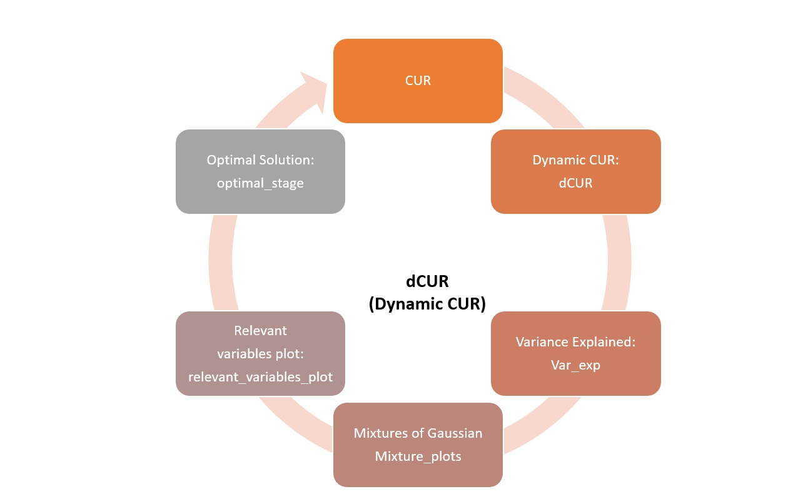

# dCUR <a href='https://www.cesargamboasanabria.com'></a>


[](https://www.gnu.org/licenses/gpl-3.0.en.html)
[](https://www.cesargamboasanabria.com/en/)

The CUR theoretical basis comes from the SVD of the matrix of interest to make a new factorization by selecting columns and rows from the original matrix. It is a low-rank approximation to the original matrix expressed in a small number of rows and columns, which are easier to interpret than the singular vectors of the SVD. The main advantage of CUR Decomposition over SVD is that the original data matrix can express a reduced number of rows and columns instead of obtaining factorial axes resulting from a linear combination of all the original variables.

The full process could be described as follows:

</a>

# Installation

You can install the **development** version from [Github](https://github.com/cgamboasanabria/dCUR)

````
remotes::install_github("cgamboasanabria/dCUR")
````

# Usage

## var_exp

It is the ratio between the variance of that principal component and the total variance with CUR technique proposal by Mahoney & Drineas (2009).

````
var_exp(AASP, standardize = TRUE, hoessem:notabachillerato)
````
## CUR

This function calculates the traditional leverage scores according to the proposal of Mahoney & Drineas (2009). The top.score method of Mahoney and Drineas is called sample CUR. The extension to Mahoney's standard procedure corresponds to the reconfiguration of the leverage scores according to the methodology of Villegas et al. (2018).

````
CUR(data=AASP, variables=hoessem:notabachillerato,
                 k=20, rows = 1, columns = .2, standardize = TRUE,
                 cur_method = "sample_cur")

CUR(data=AASP, variables=hoessem:notabachillerato,
                 k=20, rows = 1, columns = .2, standardize = TRUE,
                 cur_method = "sample_cur", correlation = R1, correlation_type = "partial")

CUR(data=AASP, variables=hoessem:notabachillerato,
                 k=20, rows = 1, columns = .2, standardize = TRUE,
                 cur_method = "sample_cur", correlation = R1, correlation_type = "partial")

CUR(data=AASP, variables=hoessem:notabachillerato,
                 k=20, rows = .9999999, columns = .10, standardize = TRUE,
                 cur_method = "mixture")
````

## relevant_variables_plot

Returns a bar graph with the higher leverages values fitted with the CUR function according to the selected columns in a matrix data.

````
results <- CUR(data=AASP, variables=hoessem:notabachillerato,
               k=20, rows = 1, columns = .2, standardize = TRUE,
               cur_method = "sample_cur")
relevant_variables_plot(results)
````

## mixture_plots

Returns the results of fit the empirical distribution of the leverage scores obtained with the CUR function to a probability distribution estimated by means of Gaussian mixture models for each of the k components with which the leverage scores can be calculated, choosing columns and rows in which that probability accumulates.

````
results <- CUR(data=AASP, variables=hoessem:notabachillerato,
               k=20, rows = .9999999, columns = .10, standardize = TRUE,
               cur_method = "mixture")
mixture_plots(results)
````

## dCUR

Dynamic CUR is a function that boosts the CUR descomposition varying the k, number of columns, and rows used, its final purposes is help to find the stage which minimizes the relative error.

````
dCUR(data=AASP, variables=hoessem:notabachillerato,
                     k=20, rows=.5, columns=.5, standardize=TRUE, 
                     cur_method="sample_cur", method="pearson",
                     parallelize =TRUE, dynamic_columns  = TRUE, 
                     dynamic_rows  = TRUE, correlation = R1, 
                     correlation_type = "partial")
````

## optimal_stage

Used to select the optimal k, the number of columns and rows of dynamic CUR object, it also produces a data frame and corresponding plots.

````
results <- dCUR(data=AASP, variables=hoessem:notabachillerato,
                     k=20, rows=.5, columns=.5, standardize=TRUE, 
                     cur_method="sample_cur", method="pearson",
                     parallelize =TRUE, dynamic_columns  = TRUE, 
                     dynamic_rows  = TRUE, correlation = R1, 
                     correlation_type = "partial")
optimal_stage(results)
````

# License

This package is free and open source software, licensed under GPL-3.
